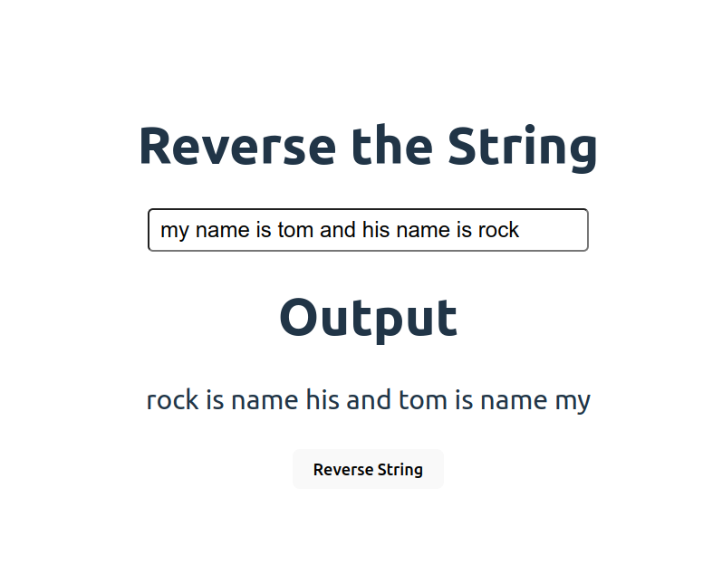

# String Reverser

In this project i will create a small string reverser project. The app will take in a string and print it in the backward order. The main focus of this project is to practice javascript.

## MVP

It should have following components to be considered complete.

- Input field to take user input
- A button to convert the string
- And an output field to show the result
- Basic CSS styling to make it presentable

## App screenshot

